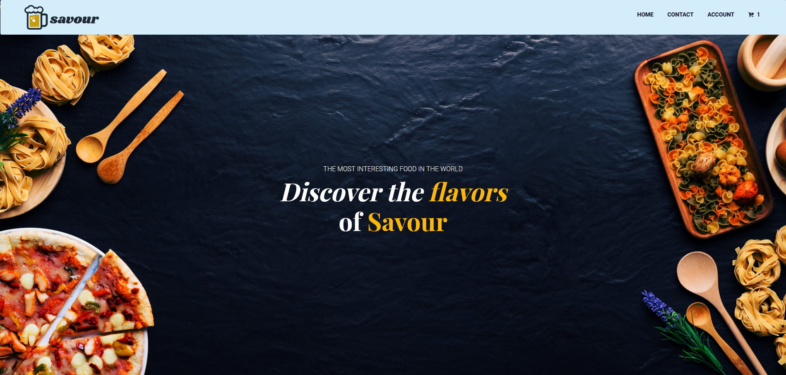
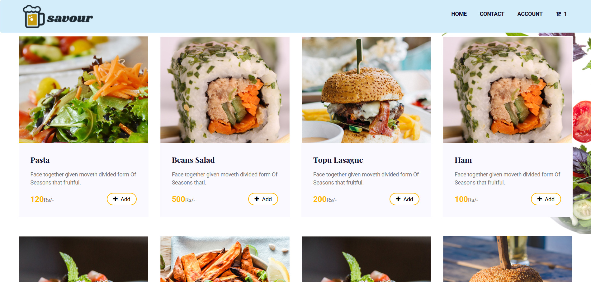
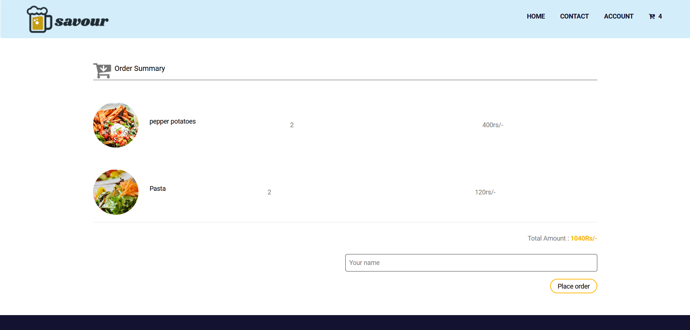
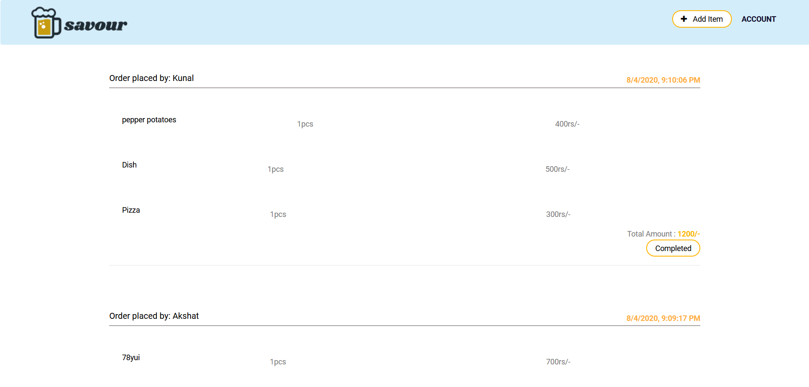
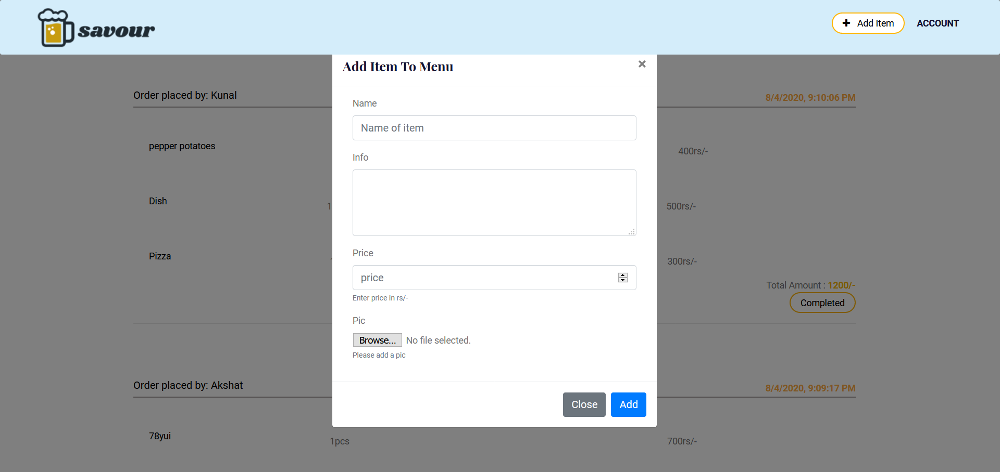

  
# Savour
Savour - A online restaurant app to ease the food ordering process . 
 
 
  
The project aim to increase social-distancing in these current  corona times 
  

# Working 
When a customer visits the shop,he/she will have to scan QrCode of which will reidrect user to <em><b>Savour</b></em> homepage.Then user can select items from    
   
and add them to the cart and simply place order .The order then will be pushed to admin page ,from where the shop owner can process the order .By doing so we try to reduce the waiting  time for customers and reduce constant nagging that owner face from customers 😂😂😂 like us .

# Tech Stack 
This project was built using 
- express 
- ejs and ejs-layouts 
- multer (image upload)
- noty (notifications package)
- mongoose 
- axios 
- passport
- express-sessions and express-flash
- cookie-parser
For database management mongo-atlas was used
   

# Installation 
Go through the package.json to get the idea about the packages used 

Steps 
- npm install
- make a .env file 
- Go through the app.js and db files and add reqquired key in your .env file mainly mongouri ,port number etc
- npm run dev for dev purposes and npm start for prod

Production build 
- npm install webpack 
- add build script to package.json and run 
- npm build

# Gallery 

## Cart
  

## Admin

## Additem

